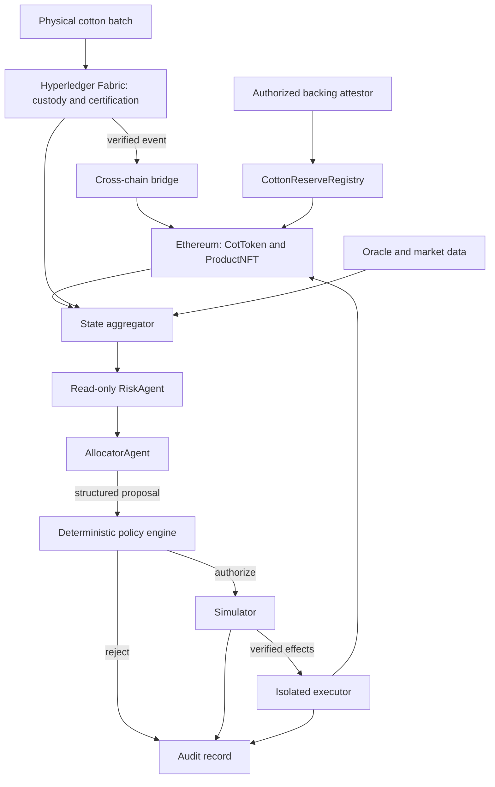

# Architecture

## 1. Problem

A public token does not prove that cotton exists, that a supplier owns it, or
that an offchain event has not already been used to mint tokens. An autonomous
model also cannot be trusted to authorize financial actions. The system links
physical custody attestations to public settlement and separates proposals from
authorization and execution.

## 2. Design Goals

Preserve Fabric and Ethereum; enforce backing at issuance, reject event replay,
reject stale oracle data, bound all agent actions and retain reconstructable audit
records. Make the portfolio demo reproducible without paid models or real funds.
The detailed completion checklist lives in [project direction](docs/PROJECT_DIRECTION.md).

## 3. System Overview

This diagram describes the implemented pipeline. The default Compose demo uses
a labelled Fabric fixture; the live integration runner verifies committed Fabric
transactions separately. Consult the completion record for test evidence.

## 4. Hyperledger Fabric Layer

Fabric is the authoritative custody record because participants need
permissioned access and organizational identities. Cotton batch verification
must bind the quantity, certification hash, provenance, verifier and transaction
timestamp. Endorsement proves agreement by configured organizations, not physical truth.
Client authentication alone does not substitute for chaincode authorization.

## 5. Ethereum Layer

Ethereum is the public settlement layer because tokenized assets need public
verification and composability. One COT represents a claim on one verified kg;
quantities use 18 decimal base units. A claim is not a legally enforceable title
or proof of redemption. ProductNFT retains provenance for finished garments.
Circular rewards must use funded token balances rather than unbacked issuance.

## 6. Cross-chain Bridge

The relay transports approved Fabric state. A distinct authorized attestor
registers backing capacity; a compromised relay should not be able to invent
reserves. Stable event identity binds Fabric transaction ID, batch ID, amount
and action. Ethereum checks replay and reserve capacity atomically with minting.
Ethereum finality and Fabric acknowledgment are separate: retries must reconcile
an already mined mint without submitting another mint. There is no distributed
transaction across both chains. The runtime contains only backed COT relay, NFT
mint reconciliation and confirmed recycling acknowledgment. Unsupported sidechain
and state-channel placeholders were removed. NFT receipt recovery validates the
original recipient and product identity even after ownership changes. Recycling
requires a successful receipt and an idempotent Fabric bridge-role transition.

## 7. Oracle Layer

Price data needs a positive finite price, nonzero update time, a completed round,
and age at most one hour. Future timestamps fail closed. Freshness does not prove
price accuracy; a manipulated but fresh feed remains a trust risk. Demo price
fixtures must be visibly labelled. Do not claim an existing cotton Chainlink
feed without verifying the configured contract and denomination.

## 8. Autonomous Agent Layer

RiskAgent is read-only. AllocatorAgent proposes HOLD, BUY_COT or SELL_COT using
structured state and risk. A deterministic baseline makes the demo repeatable;
an optional model adapter can improve proposal quality without gaining authority.
Untrusted supplier descriptions are data, never policy or executable instructions.
The model never has access to signing keys and cannot construct arbitrary transactions.

## 9. Policy Engine

Agent = proposes. Policy Engine = authorizes. Simulator = verifies effects.
Executor = executes.

YAML specifies exposure, trade size, slippage, minimum liquidity, oracle age,
backing and confidence. Decimal arithmetic avoids float boundary ambiguity.
Validation rejects unknown fields/actions and nonfinite numbers. Checks cover
post-trade state, not just current exposure. The executor rechecks current state
and requires simulation of the exact allowlisted transaction. A state hash is an
audit binding, not a guarantee that state remains unchanged during inclusion.

## 10. Threat Model

See [THREAT_MODEL.md](THREAT_MODEL.md). Critical boundaries are the attestor,
reserve registry, relay replay logic, schema, oracle validator, policy, simulator
and executor. Tests cover malicious proposals and onchain invariant violations.

## 11. Trust Assumptions

Certifiers honestly inspect cotton; Fabric organization administrators and
endorsement policies are trusted; attestors mirror those records correctly;
RPC responses, configured market contracts and feeds are authentic; executor
credentials are secured. Chain finality, operational recovery and physical
redemption need real deployment procedures beyond this local demonstration.

## 12. Trade-offs

Permissioned custody adds identity infrastructure but reduces disclosure.
Public settlement exposes quantities and transactions. Conservative cumulative
reserve consumption avoids reissuance after generic burns, at the cost of locked
capacity; releasing backing requires a dedicated redemption protocol. Two agents
are easier to evaluate than a large orchestration graph. Local fixtures enable
offline demos but do not prove a live Fabric network. Restricting execution to a
local chain and a fixed market keeps the portfolio exercise reviewable.
