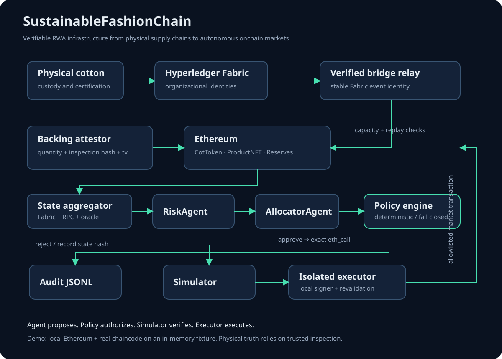
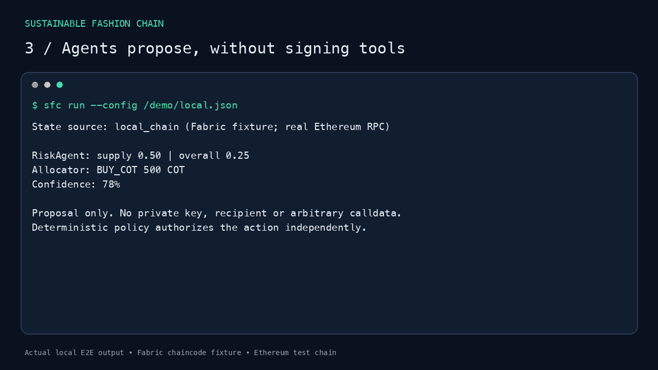

# SustainableFashionChain

Verifiable RWA infrastructure from physical supply chains to autonomous onchain markets.

SustainableFashionChain connects permissioned supply-chain data with Ethereum,
turning verified physical commodities into programmable onchain assets.

**Hyperledger Fabric → Cross-chain Bridge → Ethereum → Autonomous Agents**




[▶ Demo](#demo) · [⚡ Quick Start](#quick-start) · [🏗 Architecture](ARCHITECTURE.md) ·
[🤖 Autonomous Agent](agent/README.md) · [🔐 Security Model](THREAT_MODEL.md) ·
[🧪 E2E Tests](#verification)

**Agent = proposes · Policy Engine = authorizes · Simulator = verifies effects · Executor = executes.**

## Demo

[Watch the 80-second demonstration](docs/assets/demo.mp4): verify a cotton batch,
relay backed COT issuance, propose a trade, authorize and simulate it, then reject
an oversized proposal. [Reproduce the recording](docs/DEMO.md).



The video uses real Solidity contracts on a local Ethereum chain and the actual
Fabric chaincode with an explicitly labelled in-memory fixture. A separate live
integration runner exercises Fabric consensus, CA identities and committed events.
No real funds are used.

## Quick Start

With Docker and Docker Compose:

```sh
git clone https://github.com/Dparini/SustainableFashionChain.git
cd SustainableFashionChain
docker compose up --build
```

Bootstrap verifies 42,000 kg, registers backing with a separate attestor, relays
35,000 COT and funds a local exercise market. The agent reads actual onchain
state, proposes BUY 500 COT, checks policies and runs `eth_call`. Simulation is
the default; bootstrap transactions are confined to the local test chain.
The Ethereum service stays running after the agent exits successfully.

```sh
docker compose run --rm agent status --config /demo/local.json
docker compose run --rm agent run --config /demo/local.json
docker compose down --volumes
```

Removing demo volumes resets this demo's generated state. This Compose stack
uses a Fabric fixture; it does not start a Fabric consensus network.

For the credential-free offline agent, with Python 3.11+ and uv:

```sh
uv sync --project agent --extra test --frozen
agent/.venv/bin/sfc status
agent/.venv/bin/sfc demo
agent/.venv/bin/python -m agent run --mode simulation
agent/.venv/bin/sfc benchmark
```

Offline simulation is analytical and reports no fabricated gas estimate.
[Agent configuration and explicit local execution](agent/README.md).

## Verified assets and bridge

**1 COT = a claim representing 1 kg of verified cotton.** Each batch binds
physical custody, a Fabric record, certification hash, verification transaction,
bridge event and Ethereum reserve. ProductNFT retains garment provenance.

`CottonReserveRegistry` limits every COT issuance route to attested batch capacity:
`COT.totalSupply <= verifiedCottonKg` (both in 18-decimal units). Rewards transfer
prefunded COT. Burning does not automatically release physical reserve capacity.

The event identifier is `keccak256(abi.encode(fabricTxId, batchIdHash, amount,
"MINT_COT"))`. Ethereum records both processed events and Fabric transaction IDs.
Replaying the same event reverts with `EVENT_ALREADY_PROCESSED`; changing its
amount cannot bypass the transaction guard. A retry after a lost Fabric
acknowledgment recovers the mined receipt without minting again.

Backing attestations are trusted assertions about custody. They do not establish
legal title or prove the physical existence of cotton. See [RWA semantics](docs/RWA_MODEL.md)
and [trust assumptions](ARCHITECTURE.md).

## Autonomous Agent

RiskAgent is read-only. AllocatorAgent returns a strict HOLD, BUY_COT or SELL_COT
proposal. The default agents are deterministic; an optional local Ollama adapter
produces schema-validated proposals through the same boundaries.

The model never has access to signing keys and cannot construct arbitrary
transactions. Unknown actions, extra fields and invalid numbers are rejected.
The independent policy engine enforces:

- Exposure ≤ 35%; single trade ≤ 10% of portfolio value.
- Slippage ≤ 50 bps; venue liquidity ≥ USD 10,000.
- Oracle age ≤ 3,600 seconds; valid, positive, completed price round.
- Verified backing ≥ 100%; proposal confidence ≥ 65%.
- Available balances, supply-risk and oracle/quote consistency.

Simulation checks exact calldata, revert behavior, balance deltas, gas, exposure
and backing. The executor revalidates a fresh snapshot before signing, records an
audit trail and verifies confirmation effects. Local market contracts also enforce
freshness, slippage, deadline, exposure and trade-size limits at inclusion.
Execution requires explicit configuration and only supports local test chains.

Each decision records the canonical Keccak-256 state hash, risk, proposal, policy,
simulation and transaction. Revalidated execution snapshots are preserved too.

## Verification

Node 22+, Python 3.11+, uv and Docker are required for the full local checks.
Install JavaScript dependencies with `npm ci` in `ethereum`, `bridging`,
`fabric/application`, `fabric/chaincode/supplychain` and `frontend`.

```sh
npm test --prefix ethereum
npm test --prefix fabric/chaincode/supplychain
node --test scripts/dependency-compat.test.cjs scripts/fabric-gateway.test.cjs scripts/verified-boundaries.test.cjs
npm test --prefix fabric/application -- --runInBand
npm run lint --prefix fabric/application
agent/.venv/bin/python -m pytest agent/tests -q
node scripts/local-e2e.cjs
node scripts/fabric-live-e2e.cjs
node scripts/audit-dependencies.cjs
```

The live runner downloads pinned official Fabric tools, starts an isolated
two-organization CA network, deploys the chaincode and tests committed events
through Ethereum and guarded execution. It refuses to reuse existing Fabric
containers and removes only its own resources. Allow several minutes and keep
ports 7050–9051, 18546 and 18547 free.

Ten recorded adversarial scenarios, repeated five times, include stale/missing
oracle data, supply shock, invalid reserves, replay, low liquidity, extreme price,
hallucinated actions and excessive trades. The recorded corpus measures **90%
valid action outputs, 100% safe outcomes and 100% correct decisions**. Deliberately
invalid output explains the validity score. These are finite-suite measurements,
not a universal proof or an unmeasured comparison between models. Local model
benchmarking is available separately.

[CI](.github/workflows/verify.yml) runs Solidity, Fabric, bridge, backend, frontend,
agent, policy, security invariants, dependency audits, Compose and both E2E paths.
The badge reports the actual GitHub workflow state.

## Design and scope

[Architecture](ARCHITECTURE.md) explains the permissioned custody/public settlement
split. [Threat model](THREAT_MODEL.md) documents compromised models, prompt
injection, oracle manipulation, replay, desynchronization and key compromise.
Attestor trust and executor-key theft remain outside the policy engine's protection.
The demo market and oracle are test fixtures, not a production exchange or live
Chainlink feed. Physical redemption and permissionless cross-chain proofs remain
future lifecycle work.

[Project direction and completion record](docs/PROJECT_DIRECTION.md) preserve the
accepted transformation. [Archived prototype documentation](docs/LEGACY_SETUP.md)
retains the original detailed setup and experiments.
