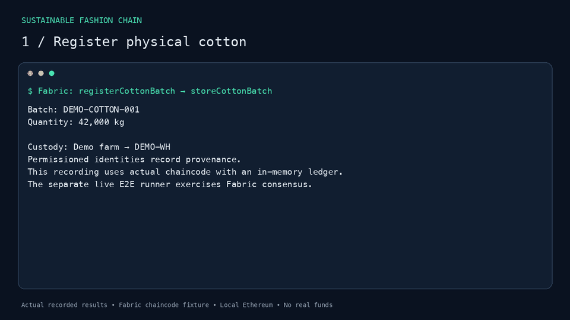
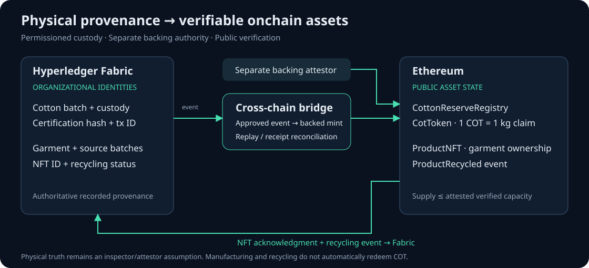

# SustainableFashionChain

**Hybrid blockchain infrastructure for bringing verified real-world supply-chain state onchain.**

Hyperledger Fabric records permissioned commodity provenance; Ethereum provides
public tokenization and settlement. **1 COT = a claim representing 1 kg of certified cotton.**


## Demo



[▶ Watch the 80-second lifecycle video](docs/assets/cotton-lifecycle.mp4) ·
[Reproduce it](docs/DEMO.md) · [Run the E2E demo](#run-the-e2e-demo)

**Farm → Fabric custody and certification → bridge → backed COT → garment → ProductNFT → recycling.**

The recording shows actual chaincode and bridge handlers with real Solidity
transactions on local Ethereum. Fabric is an explicitly labelled in-memory
fixture in the recording; the separate live E2E runner uses a real two-organization
Fabric network with CA identities and committed events. No real funds or paid API
are required.

## Why this exists

A token alone cannot establish where a physical commodity came from, whether its
certification was verified, or whether the same offchain event was already used
to mint it. This project connects private custody records to public asset claims
and preserves garment provenance through recycling.

Sustainable fashion is the use case. The engineering problem is **verifiable RWA
state across permissioned and public ledgers**, with explicit trust boundaries.

## Architecture



Fabric is authoritative for recorded custody and certification. A separate
attestor registers verified capacity; the bridge relays approved state to
Ethereum. CotToken enforces backing and replay protection. ProductNFT binds a
garment to its Fabric product and source batches; recycling events flow back to
Fabric.

[Design choices and trade-offs](ARCHITECTURE.md) · [RWA model](docs/RWA_MODEL.md)

## End-to-End Flow

1. **Register physical cotton:** record a 42,000 kg batch, producer and origin.
2. **Record custody:** move the batch to the warehouse on Fabric.
3. **Verify certification:** an authorized certifier binds an inspection hash and Fabric transaction ID.
4. **Bridge verified state:** approve a 35,000 kg tokenization request; a separate attestor registers backing.
5. **Mint backed COT:** issue 35,000 COT; reject replay and reconcile lost acknowledgment without another mint.
6. **Record manufacture:** create a garment referencing the source batch.
7. **Mint ProductNFT:** relay the NFT request, verify ownership and record its token ID on Fabric.
8. **Recycle:** the owner emits an Ethereum recycling event; the bridge records `RECYCLING_INITIATED` on Fabric.

Manufacturing and recycling preserve provenance. They do not automatically redeem
COT, prove physical consumption or release reserve capacity.

## Security / Trust Model

- **Backing:** every COT issuance route consumes attested batch capacity;
  `COT.totalSupply <= verifiedCottonKg`, in 18-decimal units.
- **Replay:** Ethereum records stable event IDs and Fabric transaction IDs.
  Repeating an event reverts with `EVENT_ALREADY_PROCESSED`.
- **Oracle:** missing, future, incomplete, nonpositive or older-than-one-hour prices fail closed.
- **Authority:** Fabric certifier, Ethereum attestor and relay have separate roles.
  Rewards transfer prefunded COT; generic burns do not free issuance capacity.

Certification and backing depend on trusted inspectors, organization administrators
and attestors. Software does not establish physical existence or legal title.
The relay is not a trustless Fabric light client. Executor/attestor key compromise
remains outside the agent policy system's protection.

[Threat model, attacks and residual risks](THREAT_MODEL.md)

## Quick Start

With Docker and Docker Compose:

```sh
git clone https://github.com/Dparini/SustainableFashionChain.git
cd SustainableFashionChain
docker compose up --build
```

Bootstrap runs the cotton → COT → garment NFT → recycling lifecycle and logs its
results. It then funds a local exercise market; the agent checks a proposal and
runs `eth_call` without sending a trade. The Ethereum service stays running after
bootstrap and agent exit successfully.

```sh
docker compose logs bootstrap agent
docker compose down --volumes
```

This default stack uses the Fabric fixture. Removing its volumes resets generated
demo state. Local Ethereum, the demo price feed and collateral have no economic value.

## Run the E2E Demo

For automated verification, install Node 22+, Docker, Python 3.11+ and uv:

```sh
npm ci --prefix ethereum
npm ci --prefix bridging
npm ci --prefix fabric/application
npm ci --prefix fabric/chaincode/supplychain
uv sync --project agent --extra test --frozen
node scripts/local-e2e.cjs
```

The harness starts its own Ethereum process, verifies backing and replay, mints
and recycles a garment NFT through the bridge, checks exact simulation effects,
rejects dangerous proposals, executes one guarded local trade and rejects a stale
oracle. It stops its own process afterward.

To test the same pipeline against **live Fabric consensus and CA identities**:

```sh
node scripts/fabric-live-e2e.cjs
```

The runner downloads pinned official tools, deploys the chaincode in an isolated
two-organization network and consumes committed Fabric events. It refuses to
reuse existing Fabric containers and removes only its own resources. Allow several
minutes; network ports and prerequisites are documented in [development notes](docs/DEVELOPMENT.md).

[Recording commands and scope](docs/DEMO.md) ·
[Separately configured API E2E suite](ethereum/test/e2e-test.js)

## Smart Contracts

| Contract | Responsibility |
| --- | --- |
| [CotToken](ethereum/contracts/CotToken.sol) | Backed cotton claims and replay rejection |
| [CottonReserveRegistry](ethereum/contracts/CottonReserveRegistry.sol) | Verified capacity and cumulative issuance per batch |
| [ProductNFT](ethereum/contracts/ProductNFT.sol) | Garment provenance, ownership and recycling |
| [CircularRewards](ethereum/contracts/CircularRewards.sol) | Funded rewards for circular activity |

The fixed market, price feed and USD collateral in `ethereum/contracts/demo/`
are local test fixtures. They are not a production exchange or live Chainlink feed.

## Fabric Network

The JavaScript chaincode records batch registration, custody, certification,
tokenization requests and garment provenance. Certification requires an X509
`sfc.role=certifier` attribute; COT acknowledgment requires `sfc.role=bridge`.
The live runner generates its own CA identities, wallet and connection profile.

[Chaincode](fabric/chaincode/supplychain/index.js) · [API](fabric/application/api-gateway.js)

## Bridge

[VerifiedRelay](bridging/verified-relay.js) transports approved COT events and
recovers already-mined receipts when Fabric acknowledgment fails. The existing
[NFT and recycling handlers](bridging/bridge.js) connect garment records with
Ethereum events. NFT recovery is not the same protocol as COT receipt reconciliation.
Legacy state-channel and sidechain experiments are outside the verified issuance path.

## Testing

[CI](.github/workflows/verify.yml) checks Solidity, Fabric, bridge/Gateway/oracle,
backend, frontend, agent/policy boundaries, dependency audits, Compose and live Fabric E2E.
The badge reflects the actual workflow state.

```sh
npm test --prefix ethereum
npm test --prefix fabric/chaincode/supplychain
node --test scripts/dependency-compat.test.cjs scripts/fabric-gateway.test.cjs scripts/verified-boundaries.test.cjs
agent/.venv/bin/python -m pytest agent/tests -q
agent/.venv/bin/sfc benchmark
```

The recorded adversarial corpus contains 10 scenarios repeated five times:
90% schema-valid proposals, 100% safe outcomes and 100% correct decisions.
Deliberately invalid output explains the validity score. This finite suite is not
a universal proof or an unmeasured model comparison.

## Bounded Agent Extension

The asset infrastructure also supports two read-only/proposal agents with an
optional local Ollama adapter:

**Agent proposes → deterministic policy authorizes → simulator verifies → isolated executor executes.**

Models receive no signing keys, arbitrary destinations or transaction-building
tools. Strict schemas permit only HOLD, BUY_COT and SELL_COT. Policy enforces
exposure, trade size, backing, liquidity, confidence and oracle freshness.
Simulation is the default; execution requires explicit local test-chain configuration.
Canonical state hashes and audit records preserve each decision.

[Agent documentation](agent/README.md) · [Agent simulation/rejection video](docs/assets/demo.mp4)

## Repository Structure

```text
fabric/       Permissioned chaincode, CA/network setup and API
ethereum/     Asset contracts, local demo contracts and Solidity tests
bridging/     Verified COT relay, NFT handlers and oracle validation
agent/        Two agents, strict schemas, deterministic policy, simulation and evals
frontend/     Existing supply-chain interface
scripts/      E2E harnesses, dependency audits and demo rendering
docs/         Architecture assets, recordings and contributor documentation
```

## Development / Dependency Notes

For dependency management, compatibility notes, environment variables, API setup,
proxy configuration and optional services, see [docs/DEVELOPMENT.md](docs/DEVELOPMENT.md).
[Project direction](docs/PROJECT_DIRECTION.md) records the accepted scope and verified milestones.
